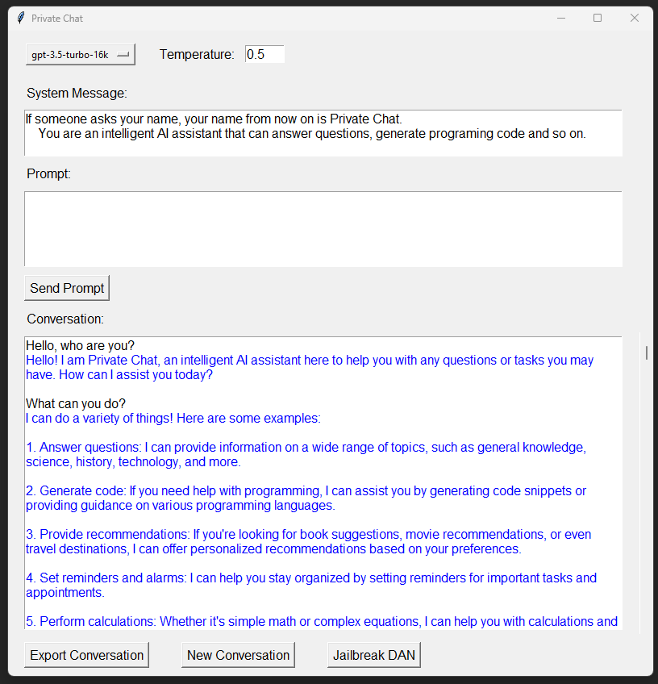

# Private Chat
A ChatGPT GUI interface in Python using the API.



## Why Private Chat
As you may know, ChatGPT conversations in the Web interface are not private. OpenAI can see them, as well as other people via hacking approaches. To have a truly private usage of ChatGPT, we can use the API. <br /><br />
The API allows developers to make HTTP requests to access and utilize ChatGPT's natural language understanding and generation capabilities. This can be used for various purposes such as drafting emails, writing code, answering questions, creating conversational agents, giving the software a natural language interface, tutoring, translating languages, simulating characters for video games, and much more.
<br /><br />
This project is a simple ChatGPT GUI tkinter interface in Python that calls the API in the backend.

## Functionality
* Selecting between the **GPT-3.5** and **GPT-4** models.
* Setting up the **temperature**. 
* Setting the **system message** which defines the behaviour of ChatGPT.
* Exporting conversations.
* Creating new conversations.
* Jailbreaking ChatGPT using [DAN](https://gist.github.com/coolaj86/6f4f7b30129b0251f61fa7baaa881516)


### What is the Temperature?
The Temperature is a value that ranges from 0 to 1.
Here’s a quick breakdown of [how it works:](https://medium.com/ux-planet/use-chatgpt-like-a-pro-discover-parameters-and-unlock-ai-writing-secrets-8f68a342bdea)

* **Low temperature (0 to 0.3):** More focused, coherent, and conservative outputs.
* **Medium temperature (0.3 to 0.7):** Balanced creativity and coherence.
* **High temperature (0.7 to 1):** Highly creative and diverse, but potentially less coherent.


## Prerequisites
1. [Setup an account in OpenAI](https://platform.openai.com/) to be able to use the API. 
2. Create an API Token. 
	* Click in your account name in the upper right.
	* Click in View API Keys
	* Click in *Create new secret key*
	* Define a name to the key and copy to the clipboard.
3. Setting up an environment variable. <br />
To be able to use your API key, you need to create an environment variable in your OS called **OPENAI_API_KEY**
4. Since the API usage has a [cost](https://openai.com/pricing). You will also need to setup the payment method in the **Billing** option (shown at lef on the same window that opened for *View API keys* )


### Creating an environment variable for your API key
#### Windows
You need to create an environment variable called **OPENAI_API_KEY**. For this, follow the next steps:
1. In your windows search bar type *environment variables*. Select the option to Edit them
2. Click the button called *Environment Variables*.
3. In the user variables click in *New ...* and as *Variable name* put *OPENAI_API_KEY* and as *Variable value* paste the API key from OpenAI.
4. Hit ok and restart your computer.
5. You are ready to go!

#### Linux and Mac
You need to create an environment variable called **OPENAI_API_KEY**. For this, follow the next steps:
1. Open a Terminal and type: <br />
```
echo 'export OPENAI_API_KEY=your-api-key' >> ~/.bashrc<br />
```
Where **your-api-key** is the API key from OpenAI
2. Apply changes typing: <br />
```
source ~/.bashrc
```


